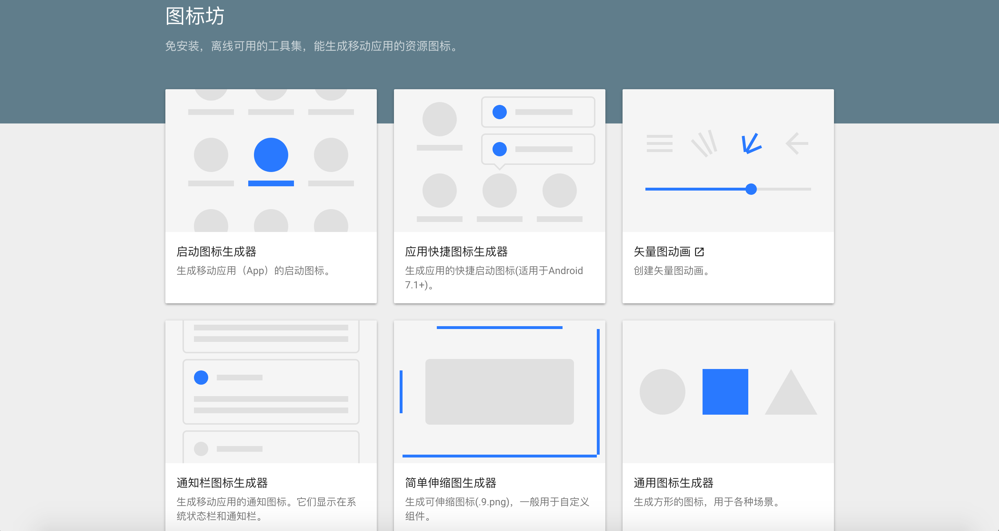

下面是我開發的產品和項目。

### <a href="https://www.samemoment.com/" target="_blank">同樂</a>

「同樂」是一個智能相片分享軟件，目前支持iOS和安卓設備。它是國內**首個**採用人臉識別來實現相片自動分享的移動應用。

<figure>
  
  
  
  <figcaption>人臉識別與自動提示分享相片－同樂</figcaption>
</figure>

同樂切入合影這個用戶場景，希望解決「個人難以獲取別人拍攝的自己的相片」這個問題。

### <a href="https://minapp.com/miniapp/2765/" target="_blank">小活動</a>
「小活動」是一個用於活動報名的小程序。你可以創建一個活動,然後分享給其他朋友或群。他們打開你的分享後便能一鍵報名。
<figure>
  
  
</figure>
你可以用微信掃描或識別下面的二維碼或小程序碼來使用 「小活動」。
<figure>
  
  
  <figcaption>小活動</figcaption>
</figure>

### <a href="https://icon.samemoment.com/" target="_blank">圖標坊</a>

「圖標坊」是一個免安裝、離線可用的工具集。助您十秒鐘製作出專業的圖標。適用於安卓、iOS、小程序和Web HTML網頁圖標設計。

<figure>
  
  <figcaption>圖標坊</figcaption>
</figure>

### 更多
想查看更多我的項目,請移步我的<a href="https://github.com/lilac" target="_blank">Github個人頁面</a>。